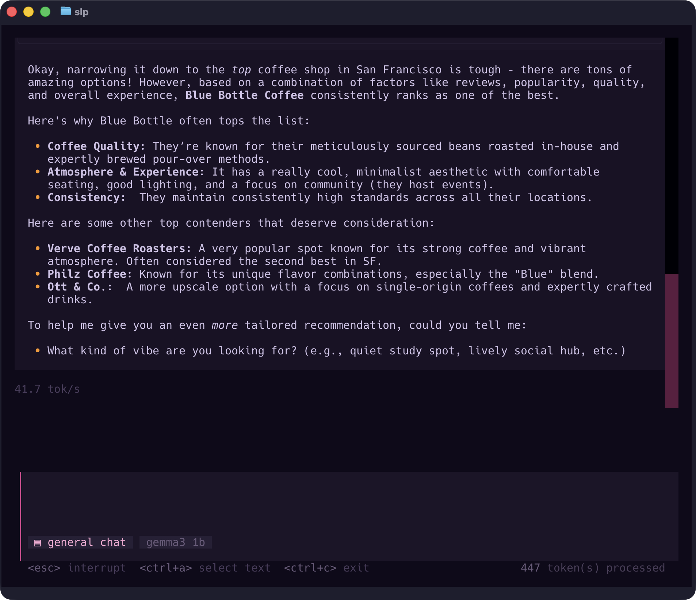

<p align="center">
  <a href="https://smartloop.ai">
    <picture>
      <source media="(prefers-color-scheme: dark)" srcset="https://github.com/user-attachments/assets/9ced8d4f-3c5d-46e5-a1e8-0b7e9e70e4d9" />
      <source media="(prefers-color-scheme: light)" srcset="https://github.com/user-attachments/assets/c08ace32-92f9-4d50-849e-ee68c4ac1a48" />
      
    </picture>
  </a>
</p>
<p align="center">An AI assistant to generate information and auto-tune from documents</p>
<p align="center">
  <a href="https://github.com/smartloop-ai/smartloop/blob/main/LICENSE"></a>
</p>

[](https://smartloop.ai)

---

### Installation

Copy and paste the following script to your terminal to get started:

```bash
curl -fsSL https://smartloop.ai/install | bash
```

Install using [Homebrew](https://brew.sh) (recommended):

**macOS**

```bash
brew tap smartloop-ai/smartloop
brew install smartloop
```

**Linux**

```bash
# Install Homebrew for Linux first (if not already installed)
/bin/bash -c "$(curl -fsSL https://raw.githubusercontent.com/Homebrew/install/HEAD/install.sh)"

brew tap smartloop-ai/smartloop
brew install smartloop
```

> [!TIP]
> To upgrade: `brew update && brew upgrade smartloop`


**From source:**

> [!NOTE]
> Requires Python 3.11. For NVIDIA GPU acceleration, install [CUDA 12.6](https://developer.nvidia.com/cuda-12-6-0-download-archive) before proceeding.

```bash
git clone https://github.com/smartloop-ai/smartloop.git
cd smartloop
pip install -r requirements.txt
python main.py run
```

### Uninstall

```bash
# If installed via Homebrew
brew uninstall smartloop
brew untap smartloop-ai/smartloop

# If installed via curl
curl -fsSL https://smartloop.ai/uninstall | bash
```

### Usage

```bash
# View available commands
slp --help

# Initialize a new project
slp init -t <developer_token>

# Add a document
slp add document.pdf

# Run interactive chat
slp run

# no tui 
slp run --no-tui
```


### Project Management

```bash
slp projects create <name>
slp projects list
slp projects switch <name>
slp status
```

### Server Management

SLP includes a background API server compatible with OpenAI's chat completion format.

```bash
slp server start
slp server stop
slp server status
```

On macOS, the server can also be managed via `brew services` (if installed using Homebrew):

```bash
brew services start smartloop
brew services stop smartloop
```

On Linux/WSL, the installer creates a systemd user service:

```bash
systemctl --user start smartloop
systemctl --user stop smartloop
systemctl --user status smartloop
```

### Requirements

| Requirement | Description | Required |
|-------------|-------------|----------|
| OS | macOS (Apple Silicon) or Linux (x86_64) or WSL | Yes |
| Python | 3.11+ | Yes |
| CUDA | 12.6+ (NVIDIA GPU acceleration) Metal | No |
| Metal| Bespoke on mac | yes |

### Troubleshooting

#### GPU not detected / Falls back to CPU

If the app falls back to CPU on a GPU-enabled system:

1. **Enable persistence mode:**
   ```bash
   sudo nvidia-smi -pm ENABLED
   ```

2. **Verify GPU detection:**
   ```bash
   nvidia-smi
   ```

If issues persist, ensure NVIDIA drivers are properly installed.

### License

© 2016 Smartloop Inc.

All code is licensed under the GPL, v3 or later. See [LICENSE](LICENSE) file for details.
